# Follow the Rules: Reasoning for Video Anomaly Detection with Large Language Model (ECCV'24)

This is the implementation for paper: [Follow the Rules: Reasoning for Video Anomaly Detection with Large Language Model](https://www.arxiv.org/pdf/2407.10299).

## Description



The AnomalyRuler pipeline consists of two main stages: induction and deduction. The induction stage involves: i) visual perception transfers normal reference frames to text descriptions; ii) rule generation derives rules based on these descriptions to determine normality and anomaly; iii) rule aggregation employs a voting mechanism to mitigate errors in rules. The deduction stage involves: i) visual perception transfers continuous frames to descriptions; ii) perception smoothing adjusts these descriptions considering temporal consistency to ensure neighboring frames share similar characteristics; iii) robust reasoning rechecks the previous dummy answers and outputs reasoning.

## Dependencies

```
pip install torch==2.1.0 torchvision==0.16.0 transformers==4.35.0 accelerate==0.24.1 sentencepiece==0.1.99 einops==0.7.0 xformers==0.0.22.post7 triton==2.1.0
```

```angular2html
pip install pandas pillow openai scikit-learn protobuf
```

## Dataset
Download the datasets and put the {train} and {test} folder under the {dataset_name} folder, for example:

```
+-- SHTech
|   +-- train
|   +-- test
    |   +-- 01_0014
        |   +-- 000.jpg
        |   +-- ...
```
Download links: 
* [SHTech](https://livejohnshopkins-my.sharepoint.com/:u:/g/personal/yyang179_jh_edu/EZQzXSY1XfZNm7gEh1zFS7IB4RA484KQD-BGEb-H_kAtVA?e=49KJ9h)
* [ped2 and avenue](https://github.com/feiyuhuahuo/Anomaly_Prediction?tab=readme-ov-file)
* [UBNormal](https://github.com/lilygeorgescu/UBnormal)

## Run

### Step 1: Visual Perception
```
python image2text.py --data='SHTech'
```

### Step 2: Rule Generation + Rule Aggregation
```angular2html
python main.py --data='SHTech' --induct --b=1 --bs=10
```

### Step 3: Perception Smoothing
```angular2html
python majority_smooth.py --data='SHTech'
```

### Step 4: Robust Reasoning
```angular2html
python main.py --data='SHTech' --deduct
```


## Citation

```angular2html
@inproceedings{yang2024anomalyruler,
    title={Follow the Rules: Reasoning for Video Anomaly Detection with Large Language Model},
    author={Yuchen Yang and Kwonjoon Lee and Behzad Dariush and Yinzhi Cao and Shao-Yuan Lo},
    year={2024},
    booktitle={Proceedings of the European Conference on Computer Vision (ECCV)}
}
```
